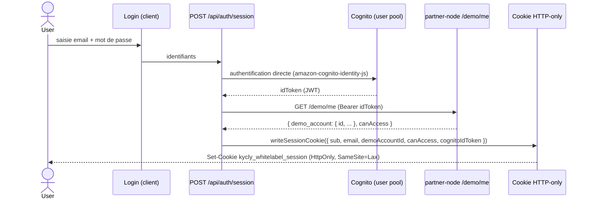

# Data Flow: Authentification Cognito directe

**Statut** : Data-flow vérifié du parcours d'authentification J1.
**Audience** : Développeurs backend/frontend, architectes.
**Lire ensuite** : [kyc-session-create.md](kyc-session-create.md).

## Vue d'ensemble

`whitelabel-vercel` authentifie un utilisateur **déjà provisionné dans Cognito** (même user pool que
`partner-node`, app client dédié). Le login est **direct** (formulaire → Cognito), le JWT est **vérifié
côté serveur**, puis conservé dans un **cookie HTTP-only signé** — jamais exposé au navigateur.

**Code source analysé** :
- `src/auth/cognito.ts` — login Cognito + résolution du compte démo via `/demo/me`
- `src/auth/session.ts` — cookie de session applicative (jose, HS256, HTTP-only)
- `app/api/auth/session/route.ts` — route `POST /api/auth/session`
- `src/config/env.ts` — bases URL et secret de session

## Séquence

## Points de contrôle vérifiés

- **Le token Cognito ne quitte jamais le client en clair** : il est stocké *dans* le cookie de session
  signé serveur (`src/auth/session.ts` — champ `cognitoIdToken` du `sessionSchema`), utilisé ensuite pour
  authentifier les appels `partner-node /kyclink/*` et `/demo/me`.
- **Cookie** : `httpOnly: true`, `sameSite: "lax"`, `secure` hors `local`, TTL 8 h (`SESSION_TTL_SECONDS`).
- **Autorisation** : `canAccess` (dérivé des claims / `/demo/me`) gouverne l'accès aux écrans protégés ;
  un refus route vers `ACCESS_DENIED`.
- **`demoAccountId`** est résolu ici et porté dans la session ; il sert de scope pour la liste des
  vérifications (`GET /kyclink/sessions`).

## Voir aussi

- ADR [001](../decisions/001-direct-cognito-auth-flow.md) — pourquoi le flux Cognito direct.
- ADR [005](../decisions/005-partner-node-direct-ip-cloudflare-bypass.md) — `/demo/me` était bloqué par Cloudflare (access-denied post-login) ; `KYCLY_BASE_URL` pointe sur l'IP directe en contournement.
- Référence : [AUTH-UX](../../reference/AUTH-UX.md).
