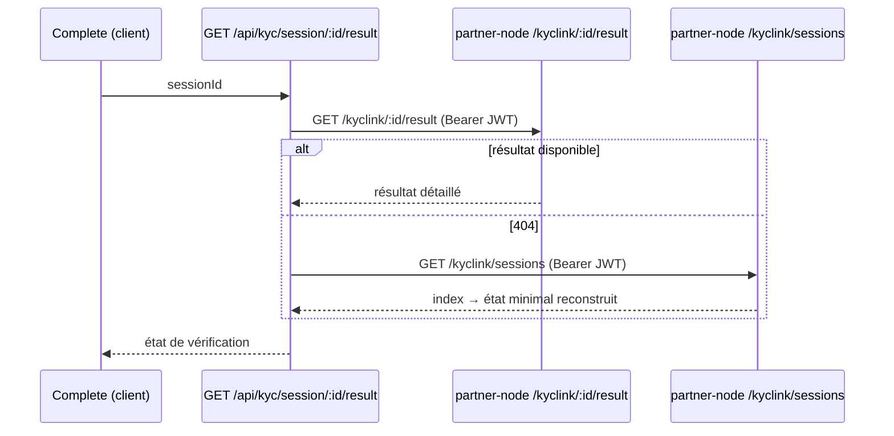

# Data Flow: Création de session KYC

**Statut** : Data-flow vérifié de la création de session et du lancement KycLink.
**Audience** : Développeurs backend/frontend, architectes.
**Lire d'abord** : [direct-cognito-auth.md](direct-cognito-auth.md).

## Vue d'ensemble

Une fois l'utilisateur authentifié, `whitelabel-vercel` crée une session KYC **côté serveur** en
proxifiant `partner-node /kyclink/create`, puis lance `@kycly/link`. L'app **ne détient aucune clé
`ck_demo_*`** : elle présente le **JWT Cognito** en `Bearer`, et `partner-node` résout le compte démo et
sélectionne la bonne clé.

**Code source analysé** :
- `app/api/kyc/session/route.ts` — `POST /api/kyc/session`
- `src/server/kyclink.ts` — `createKycSession`, `fetchKycSessionResult`, liste des sessions
- `src/auth/session.ts` — lecture de la session (JWT Cognito)

## Séquence

```mermaid
sequenceDiagram
    actor User
    participant UI as Verify (client)
    participant API as POST /api/kyc/session
    participant SESS as readSession()
    participant PN as partner-node /kyclink/create
    participant LINK as @kycly/link

    User->>UI: formulaire SESSION_CONTEXT (référence client…)
    UI->>API: contexte de session
    API->>SESS: readSession() → cognitoIdToken
    API->>PN: POST /kyclink/create (Bearer JWT)\n{ externalId, parentOrigin, metadata }
    PN-->>API: { sessionId, ... }
    API-->>UI: sessionId
    UI->>LINK: montage @kycly/link (sessionId)
    Note over LINK: parcours KYC guidé (Regula, liveness…)
    LINK-->>UI: COMPLETE | FAILURE (postMessage)
```

## Lecture du résultat et repli



## Points de contrôle vérifiés

- **`externalId`** est dérivé de la référence client (`normalizeExternalId`, `src/server/kyclink.ts`) ;
  `metadata` provient du formulaire (`buildSessionMetadata`).
- **Aucune clé locale** : `createKycSession` n'envoie **que** `Authorization: Bearer <cognitoIdToken>`
  (`src/server/kyclink.ts` ~l.165). La sélection `demo_account → ck_demo_*` est **entièrement côté
  partner-node** (cf. ADR [003](../decisions/003-ck-demo-selection-partner-node.md)).
- **Base URL** : `env.server.kyclyApiBaseUrl` (défaut `https://api.kycly.sn`), doit pointer
  `partner-node sandbox` (invariant sandbox-only).
- **Repli résultat** : un `404` sur `/kyclink/:id/result` déclenche une reconstruction depuis
  `GET /kyclink/sessions` (fallback serveur, pas de persistance locale).

## Voir aussi

- ADR [002](../decisions/002-sandbox-only-ck-demo.md), [003](../decisions/003-ck-demo-selection-partner-node.md).
- Référence : [KYC-SESSIONS-LIST-CONTRACT](../../reference/KYC-SESSIONS-LIST-CONTRACT.md), [KYCLINK-SDK-INTEGRATION](../../reference/KYCLINK-SDK-INTEGRATION.md).
