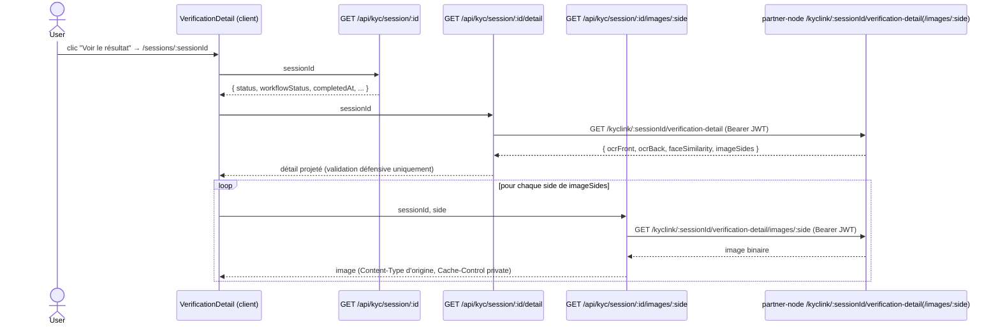

# Data Flow: Détail de la vérification (OCR + images)

**Statut** : Data-flow vérifié de l'écran détail (`/sessions/:sessionId`).
**Audience** : Développeurs backend/frontend, architectes.
**Lire d'abord** : [kyc-session-create.md](kyc-session-create.md).

## Vue d'ensemble

Depuis la liste des sessions (`/sessions`), le lien **« Voir le résultat »** ouvre désormais
`/sessions/:sessionId` — un écran distinct de l'ancien compte à rebours post-soumission
(`/complete`, inchangé, cf. ADR-08). Cet écran combine deux appels :

1. **Statut / décision** — `GET /api/kyc/session/:id` (route existante, réutilisée telle quelle).
2. **Détail OCR + images** — `GET /api/kyc/session/:id/detail` (nouveau), qui proxifie
   `partner-node GET /kyclink/:sessionId/verification-detail`.

Les images (recto/verso/portrait/liveness) sont re-proxifiées une à une via
`GET /api/kyc/session/:id/images/:side` → `partner-node GET
/kyclink/:sessionId/verification-detail/images/:side`.

**Gap d'architecture résolu (Task 0)** : partner-node ne disposait d'aucune route démo-scopée
capable de résoudre `sessionId → verificationId` (`getLocalVerification` ne matchait que sur
`remote_verification_id`/`id`, jamais `session_id`). Plutôt que d'étendre la route réviseur
`/verifications/:id`, un **nouvel endpoint démo dédié** a été ajouté côté `partner-node` (dépôt
distinct — `getLocalVerificationBySessionId`), exposé par les deux routes
`verification-detail`/`verification-detail/images/:side` de son `kyclink-sessions.ts`. La réponse
est **propre par construction** (pas de champs techniques à filtrer côté whitelabel).

**Code source analysé** :
- `src/server/kyclink.ts` — `fetchKycVerificationDetail`, `fetchKycVerificationImage`
- `src/server/verification-detail.ts` — `VerificationDetail`, `projectVerificationDetail`
- `app/api/kyc/session/[sessionId]/detail/route.ts` — `GET /api/kyc/session/:id/detail`
- `app/api/kyc/session/[sessionId]/images/[side]/route.ts` — `GET /api/kyc/session/:id/images/:side`
- `app/sessions/[sessionId]/page.tsx`, `src/components/verify/verification-detail.tsx`
- `src/lib/ocr-format.ts` — `formatOcrLabel` (labels OCR, porté de partner-node `formatFieldLabel`)

## Séquence

## Points de contrôle vérifiés

- **Portée démo** : les deux routes partner-node exigent `requiresSandboxDemoScope` — un
  `demoAccountId` scope l'accès, cohérent avec le reste des routes `kyclink-sessions.ts`.
- **États non terminaux** : tant que `status !== "completed"`, l'écran n'affiche qu'un message
  d'attente (pas d'appel OCR/images inutile côté UX, mais l'appel `/detail` reste effectué —
  `imageSides`/`ocrFront`/`ocrBack` vides si la vérification n'est pas terminée).
- **Écran distinct de `/complete`** : `/complete` (compte à rebours post-soumission) n'est **pas**
  modifié ; `/sessions/:sessionId` est un point d'entrée séparé, accessible uniquement depuis la
  liste des sessions.
- **Pas de test unitaire de composant** : ce repo n'a pas d'outillage de test unitaire React
  (`@testing-library/react`/jsdom absents) ; le rendu est couvert par les specs Playwright
  (`e2e/*.spec.ts`), la logique de fetch/projection par les tests serveur
  (`src/server/kyclink.test.ts`, `src/server/verification-detail.test.ts`, tests de route sous
  `app/api/kyc/session/[sessionId]/**`).

## Réorg visuelle (2026-07-22)

L'écran `verification-detail.tsx` a été restylé pour s'inspirer de l'affichage détail vérification de
`dashboard-node` (`VerificationDataPanel/*`) : badge de statut coloré, similarité faciale en pourcentage
avec barre de progression, champs OCR en paires clé/valeur, images ouvrables en plein écran
(`image-lightbox.tsx`). **Aucune nouvelle donnée ni nouvel appel réseau** — les mêmes champs
`workflowStatus`/`faceSimilarity`/`ocrFront`/`ocrBack`/`imageSides` (contrat inchangé, cf. section
ci-dessus) sont simplement présentés différemment.

Une seconde passe (Task 14, même lot) a réorganisé la **disposition** des trois panneaux pour se
rapprocher davantage de `dashboard-node` : la similarité faciale a été remontée dans la carte "Decision
backend" (juste sous Reference/Finalisé le, au lieu d'être isolée en bas d'écran) ; une nouvelle section
"Document" regroupe les images — sous-groupe "Evidence" (portrait/liveness) en mini-grille de vignettes,
puis barre "Scans document" (recto/verso) en boutons `Eye + label`, via le helper pur
`groupImageSides` (`src/components/verify/image-sides.ts`, aucun nouveau champ, classement local du
même `imageSides: string[]`) ; la carte OCR est déplacée en dernier. Toujours aucune nouvelle donnée ni
nouvel appel réseau.

Une troisième passe (Task 16, même lot) est un **polish purement visuel**, toujours zéro nouvelle
dépendance npm : la police Inter est désormais réellement chargée (`next/font/google` dans
`app/layout.tsx`, remplace un fallback silencieux vers `system-ui`) ; les cartes utilisent les ombres
`--shadow-soft` déjà définies dans `globals.css` mais jusqu'ici inutilisées ; le badge de statut plein
devient une pastille discrète (point coloré + texte) ; la barre de similarité devient une jauge à
graduations pilotée par `--brand-primary` via le helper pur `computeConfidenceTicks`
(`src/lib/confidence-ticks.ts`) au lieu d'un `emerald-500` codé en dur sans lien avec la marque ; les
lignes "Scans document" gagnent un chevron ; une animation d'entrée unique (`animate-fade-in`, déjà
définie) s'applique au chargement, avec un `prefers-reduced-motion: reduce` ajouté à `globals.css`.

## Voir aussi

- [kyc-session-create.md](kyc-session-create.md) — création de session et lecture du statut.
- Référence : [KYCLINK-SDK-INTEGRATION](../../reference/KYCLINK-SDK-INTEGRATION.md).
