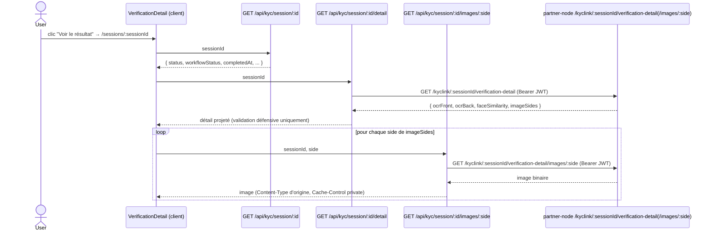

# Data Flow: Détail de la vérification (OCR + images)

**Statut** : Data-flow vérifié de l'écran détail (`/sessions/:sessionId`).
**Audience** : Développeurs backend/frontend, architectes.
**Lire d'abord** : [kyc-session-create.md](kyc-session-create.md).

## Vue d'ensemble

`/sessions/:sessionId` est **l'unique écran de résultat** de l'application. Il est atteint par
quatre chemins — fin de soumission dans le widget, « Voir le résultat » depuis la liste, reprise
d'une session déjà soumise via la gate, accès direct par URL — et rend exactement la même chose dans
tous les cas : le rendu dépend du seul `sessionState`, jamais de la provenance. Cet écran combine
deux appels :

1. **Statut / décision** — `GET /api/kyc/session/:id` (route existante, réutilisée telle quelle).
2. **Détail OCR + images** — `GET /api/kyc/session/:id/detail` (nouveau), qui proxifie
   `partner-node GET /kyclink/:sessionId/verification-detail`.

Les images (recto/verso/portrait/liveness) sont re-proxifiées une à une via
`GET /api/kyc/session/:id/images/:side` → `partner-node GET
/kyclink/:sessionId/verification-detail/images/:side`.

**Gap d'architecture résolu (Task 0)** : partner-node ne disposait d'aucune route démo-scopée
capable de résoudre `sessionId → verificationId` (`getLocalVerification` ne matchait que sur
`remote_verification_id`/`id`, jamais `session_id`). Plutôt que d'étendre la route réviseur
`/verifications/:id`, un **nouvel endpoint démo dédié** a été ajouté côté `partner-node` (dépôt
distinct — `getLocalVerificationBySessionId`), exposé par les deux routes
`verification-detail`/`verification-detail/images/:side` de son `kyclink-sessions.ts`. La réponse
est **propre par construction** (pas de champs techniques à filtrer côté whitelabel).

**Code source analysé** :
- `src/server/kyclink.ts` — `fetchKycVerificationDetail`, `fetchKycVerificationImage`
- `src/server/verification-detail.ts` — `VerificationDetail`, `projectVerificationDetail`
- `app/api/kyc/session/[sessionId]/detail/route.ts` — `GET /api/kyc/session/:id/detail`
- `app/api/kyc/session/[sessionId]/images/[side]/route.ts` — `GET /api/kyc/session/:id/images/:side`
- `app/sessions/[sessionId]/page.tsx`, `src/components/verify/verification-detail.tsx`
- `src/lib/ocr-format.ts` — `formatOcrLabel` (labels OCR, porté de partner-node `formatFieldLabel`)

## Séquence

```mermaid
sequenceDiagram
    actor User
    participant UI as VerificationDetail (client)
    participant STATUS as GET /api/kyc/session/:id
    participant DETAIL as GET /api/kyc/session/:id/detail
    participant IMG as GET /api/kyc/session/:id/images/:side
    participant PN as partner-node /kyclink/:sessionId/verification-detail(/images/:side)

    User->>UI: clic "Voir le résultat" → /sessions/:sessionId
    UI->>STATUS: sessionId
    STATUS-->>UI: { status, workflowStatus, completedAt, ... }
    UI->>DETAIL: sessionId
    DETAIL->>PN: GET /kyclink/:sessionId/verification-detail (Bearer JWT)
    PN-->>DETAIL: { ocrFront, ocrBack, faceSimilarity, imageSides }
    DETAIL-->>UI: détail projeté (validation défensive uniquement)
    loop pour chaque side de imageSides
        UI->>IMG: sessionId, side
        IMG->>PN: GET /kyclink/:sessionId/verification-detail/images/:side (Bearer JWT)
        PN-->>IMG: image binaire
        IMG-->>UI: image (Content-Type d'origine, Cache-Control private)
    end
```

## Points de contrôle vérifiés

- **Portée démo** : les deux routes partner-node exigent `requiresSandboxDemoScope` — un
  `demoAccountId` scope l'accès, cohérent avec le reste des routes `kyclink-sessions.ts`.
- **États non terminaux** : le rendu est choisi par `selectVerificationView`
  (`src/components/verify/verification-view-state.ts`) à partir de `sessionState` et de la présence
  du détail. `SUBMITTED` et `COMPLETED`-sans-détail affichent une attente et pollent ; `ACTIVE`
  (jamais soumise) et `EXPIRED` affichent un message avec CTA et **ne pollent pas**.
- **Poll unique et borné** : premier appel immédiat, backoff 5→20 s, 12 tentatives
  (`src/lib/verification-poll.ts`). Le bornage n'est acceptable que parce que
  `GET /api/kyc/session/:id` réconcilie l'amont côté partner-node à chaque appel : le poll fait
  converger le cycle de vie au lieu d'attendre passivement un webhook.
- **Pas de test unitaire de composant** : ce repo n'a pas d'outillage de test unitaire React
  (`@testing-library/react`/jsdom absents) ; le rendu est couvert par les specs Playwright
  (`e2e/*.spec.ts`), la logique de fetch/projection par les tests serveur
  (`src/server/kyclink.test.ts`, `src/server/verification-detail.test.ts`, tests de route sous
  `app/api/kyc/session/[sessionId]/**`).

## Réorg visuelle (2026-07-22)

L'écran `verification-detail.tsx` a été restylé pour s'inspirer de l'affichage détail vérification de
`dashboard-node` (`VerificationDataPanel/*`) : badge de statut coloré, similarité faciale en pourcentage
avec barre de progression, champs OCR en paires clé/valeur, images ouvrables en plein écran
(`image-lightbox.tsx`). **Aucune nouvelle donnée ni nouvel appel réseau** — les mêmes champs
`workflowStatus`/`faceSimilarity`/`ocrFront`/`ocrBack`/`imageSides` (contrat inchangé, cf. section
ci-dessus) sont simplement présentés différemment.

Une seconde passe (Task 14, même lot) a réorganisé la **disposition** des trois panneaux pour se
rapprocher davantage de `dashboard-node` : la similarité faciale a été remontée dans la carte "Decision
backend" (juste sous Reference/Finalisé le, au lieu d'être isolée en bas d'écran) ; une nouvelle section
"Document" regroupe les images — sous-groupe "Evidence" (portrait/liveness) en mini-grille de vignettes,
puis barre "Scans document" (recto/verso) en boutons `Eye + label`, via le helper pur
`groupImageSides` (`src/components/verify/image-sides.ts`, aucun nouveau champ, classement local du
même `imageSides: string[]`) ; la carte OCR est déplacée en dernier. Toujours aucune nouvelle donnée ni
nouvel appel réseau.

Une troisième passe (Task 16, même lot) est un **polish purement visuel**, toujours zéro nouvelle
dépendance npm : la police Inter est désormais réellement chargée (`next/font/google` dans
`app/layout.tsx`, remplace un fallback silencieux vers `system-ui`) ; les cartes utilisent les ombres
`--shadow-soft` déjà définies dans `globals.css` mais jusqu'ici inutilisées ; le badge de statut plein
devient une pastille discrète (point coloré + texte) ; la barre de similarité devient une jauge à
graduations pilotée par `--brand-primary` via un helper pur (`computeConfidenceTicks`) au lieu d'un
`emerald-500` codé en dur sans lien avec la marque ; les
lignes "Scans document" gagnent un chevron ; une animation d'entrée unique (`animate-fade-in`, déjà
définie) s'applique au chargement, avec un `prefers-reduced-motion: reduce` ajouté à `globals.css`.

## Alignement `@kycly/ui` (2026-07-22)

Refacto cross-repo : le score de confiance (`validationScore`, restauré côté partner-node dans la
réponse `GET /kyclink/:sessionId/verification-detail`) est désormais plombé de bout en bout
(`projectVerificationDetail`, type `VerificationDetail`) et affiché comme une barre de progression
lissée (`role="progressbar"`, `aria-valuenow`), en plus du pourcentage de similarité visage déjà
affiché — les deux affichages sont indépendants l'un de l'autre. La jauge à graduations
(`computeConfidenceTicks`) est retirée à cette occasion : les helpers `confidence-ticks` et
`similarity-format` de `src/lib/` sont supprimés (plus aucun appelant en production). L'écran détail et
5 écrans secondaires (`verification-prepare-screen.tsx`, `verification-complete.tsx`,
`verification-session-gate.tsx`, `failure-screen.tsx`, `access-denied-screen.tsx`,
`auth-loading-screen.tsx`) basculent leurs conteneurs bespoke sur `SurfaceCard` du design system
partagé `@kycly/ui`, et le badge de statut sur `StatusBadge` (via le wrapper
`VerificationStatusBadge`). Toujours aucune nouvelle donnée ni nouvel appel réseau au-delà de
`validationScore`.

## Unification de l'écran de résultat (2026-07-25)

`/complete` (`VerificationComplete`) était l'écran de résultat **unique** de l'application depuis le
commit initial, avec trois points d'entrée convergents. Le run du 2026-07-21 a créé
`/sessions/:sessionId` pour le remplacer mais n'a migré qu'**un** point d'entrée sur trois, en
inscrivant la scission comme décision de design. Une PR ultérieure en a migré un deuxième, ce qui a
amené sur l'écran détail des sessions sans décision — d'où une série de correctifs qui
réimplémentaient sur cet écran le polling que `/complete` faisait déjà.

Le dernier point d'entrée est désormais migré (fin de soumission → `/sessions/:sessionId`) et
`/complete` est **supprimé sans redirection**, avec `verification-complete.tsx` et
`workflowStatusTone`. Deux modules purs portent la logique : `src/lib/verification-poll.ts`
(cadence) et `src/components/verify/verification-view-state.ts` (`SessionState`, type unique du
cycle de vie côté front, et `selectVerificationView`).

Côté partner-node, `resolveKyclinkSessionState` gagne l'état `SUBMITTED` et
`GET /kyclink/:sessionId` réconcilie l'amont : sans cette réconciliation, l'écran détail pollait une
vue locale en lecture seule et **ne pouvait pas converger** si le webhook KYCLY était perdu.
`GET /kyclink/:sessionId/result` — seule route qui réconciliait auparavant — est supprimée, ainsi que
`/api/kyc/session/:id/result` et `fetchKycSessionResult`. La liste lit `resumeAvailable` au lieu de
recalculer la reprenabilité : plus aucun fichier de ce dépôt ne dérive « soumise / reprenable /
terminée ».

## Voir aussi

- [kyc-session-create.md](kyc-session-create.md) — création de session et lecture du statut.
- Référence : [KYCLINK-SDK-INTEGRATION](../../reference/KYCLINK-SDK-INTEGRATION.md).

> Documentation Sync: 2026-08-15
